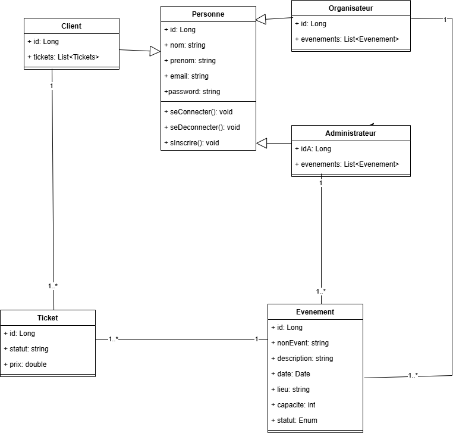

# 🎟️ Application de Vente de Tickets de Concert en Ligne

## Sommaire
- [1. État d'avancement](#1-état-davancement)
- [2. Démarrage du projet](#2-démarrage-du-projet)
- [3. Accès à l'API via Swagger](#3-accès-à-lapi-via-swagger)
- [4. Modèle métier](#4-modèle-métier)
- [5. Contexte du projet](#5-contexte-du-projet)
- [6. Fonctionnalités principales](#6-fonctionnalités-principales)
- [7. Exigences techniques](#7-exigences-techniques)

---

## 1. État d'avancement

Nous avons terminé :
- **TP5** : Des servlets aux services Web
- **TP2** : Des servlets aux API REST documentées avec OpenAPI

### Fonctionnalités développées

- Base de données configurée avec **JPA**.
- Modèle métier initial avec entités et relations.
- Gestion de l’héritage pour `Organisateur`, `Client`, `Administrateur` héritant de `Personne`.
- **DAO** (Data Access Objects) pour la gestion des entités en base.
- Couche **DTO** (Data Transfer Objects).
- Couche **Service** métier.
- Couche **REST** avec endpoints de base.
- Intégration d'**OpenAPI** avec **Swagger UI**.

> Base de données utilisée : **MySQL**  
> Connexion : `jdbc:mysql://localhost:3306/mydatabase`  
> Identifiants : `user=root`, `password=""`

### Fonctionnalités REST

- **AdministrateurResource**, **OrganisateurResource**, **ClientResource** :
  - `getById`, `getAll`, `create`, `update`, `delete` fonctionnent via Swagger.
- **EvenementResource**, **TicketResource** :
  - `getById`, `getAll`, `delete` fonctionnent via Swagger.

---

## 2. Démarrage du projet

1. Exécuter **JpaTest.java** pour créer la base de données MySQL.
2. Exécuter **RestServer.java** pour démarrer le serveur REST.

> 💡 Pour ajouter manuellement des données à la base, modifiez et exécutez **JpaTest.java**.

---

## 3. Accès à l'API via Swagger

- [Swagger UI - API REST](http://localhost:8080/api/)

---

## 4. Modèle métier

---

## 5. Contexte du projet

Le but de ce projet est de développer une application web et mobile permettant :
- aux **utilisateurs** d’acheter des tickets de concerts,
- aux **organisateurs** de gérer leurs événements facilement.

L'application garantit une expérience fluide, sécurisée et intuitive.

---

## 6. Fonctionnalités principales

### Utilisateurs
- **Recherche et consultation** :
  - Par artiste, lieu, date, genre musical.
  - Détails : date, lieu, prix, description.
  - Filtres et tri (prix, date, popularité).
- **Achat de tickets** :
  - Sélection des places (si applicable).
  - Envoi par email ou téléchargement direct.
  - Annulation et remboursement (selon conditions).
- **Gestion des tickets** :
  - Espace personnel pour consulter les tickets achetés.
  - Possibilité de transférer un ticket.
- **Notifications** :
  - Alertes pour nouveaux concerts, rappels et promotions.

### Organisateurs
- **Gestion des événements** :
  - Création, modification, suppression d'événements.
  - Gestion des détails : date, lieu, prix, capacité.
  - Gestion du stock de tickets.
- **Statistiques et rapports** :
  - Suivi des ventes en temps réel.
  - Analyse des performances.
- **Communication** :
  - Notifications aux acheteurs pour changements ou annulations.

### Administrateurs
- **Gestion administrative** :
  - Validation des événements créés.
  - Modération des contenus proposés.

---

## 7. Exigences techniques

| Composant        | Technologies                                           |
|------------------|---------------------------------------------------------|
| Plateforme Web   | Compatible Chrome, Firefox, Safari, Edge                |
| Front-end        | HTML5, CSS3, JavaScript (**React.js** ou **Angular**)    |
| Back-end         | **Java** (JPA, Servlets, REST)                           |
| Base de données  | **MySQL** ou **PostgreSQL**                              |
| Paiement         | Intégration API (Stripe, PayPal) *(optionnel)*           |

---
